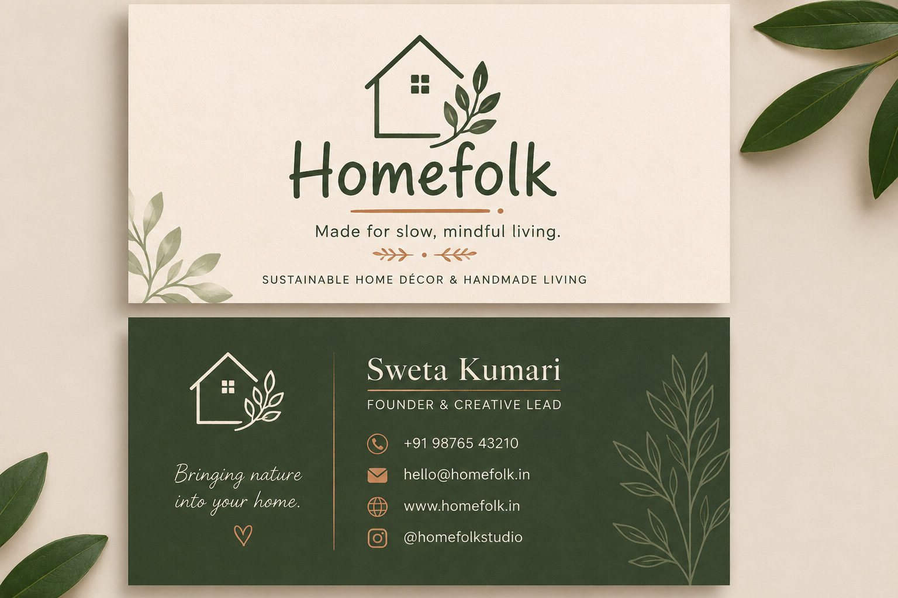

# ✨ Task 3 Completed | Business Card Design

Sharing my third task from my Graphic Design Internship at SkillCraft Technology.

## 📌 Project Overview

For this task, I designed a two-sided business card for **Homefolk**, a sustainable home décor and handmade-living brand.

The design continues Homefolk’s earthy visual identity through deep green, soft cream, leaf illustrations, and warm brown accents. The front side introduces the brand and its purpose, while the back side keeps the contact details clear, organised, and easy to read.

My aim was to create a business card that feels professional while still carrying the calm, natural, and handmade personality of Homefolk.

## 🎨 Business Card Preview

## ✨ Key Design Elements

- **Earthy Colour Palette** — Deep green, soft cream, and warm brown create a natural and sustainable feel.
- **Brand Consistency** — The design follows Homefolk’s calm, handmade, and eco-friendly visual identity.
- **Clear Layout** — Important contact details are organised for easy readability.
- **Nature-Inspired Details** — Leaf illustrations add a warm and organic touch to the card.

## 🛠 Tools Used

- Canva
- Freepik

## 🌱 What I Learned

- How to design a two-sided business card with a balanced layout.
- How to maintain brand consistency across different design materials.
- How to combine creativity with clear and practical information.

---

**Designed by:** Sweta Kumari  
**Internship:** Graphic Design Internship | SkillCraft Technology  

#GraphicDesign #BusinessCardDesign #BrandIdentity #Homefolk #Branding #StationeryDesign #CanvaDesign #DesignInternship #SkillCraftTechnology #CreativeJourney
